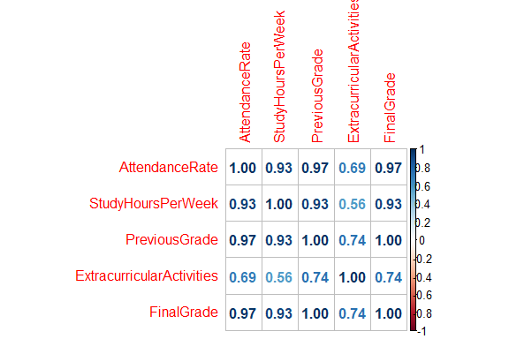
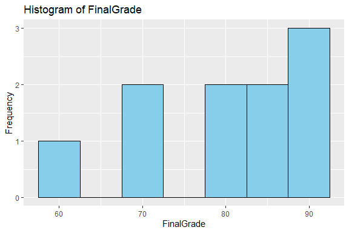
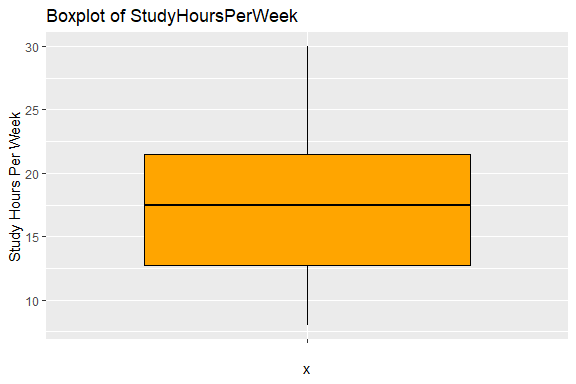
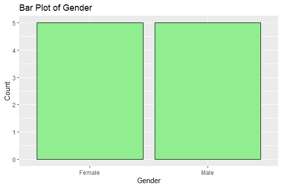
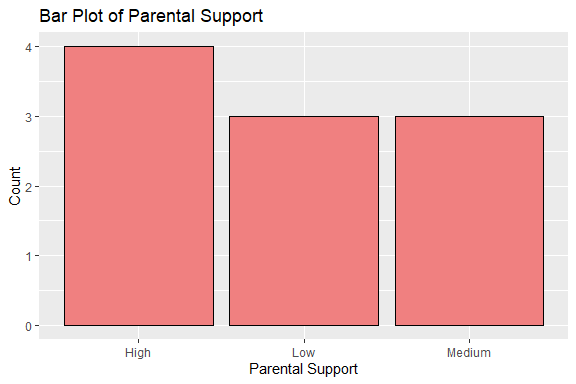
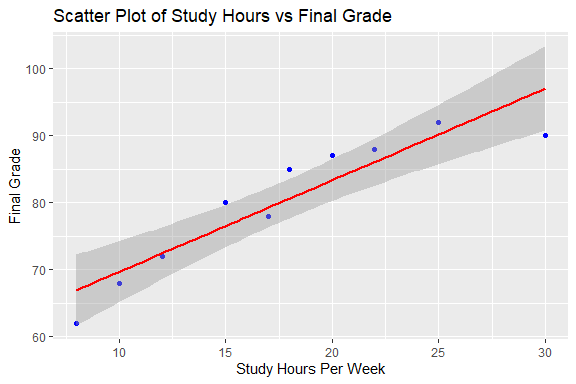
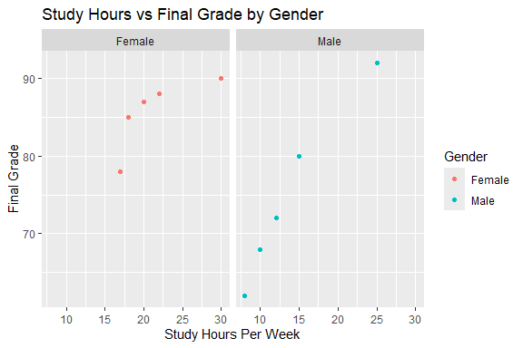
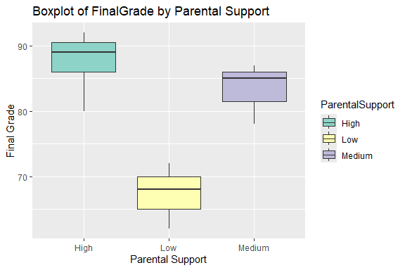
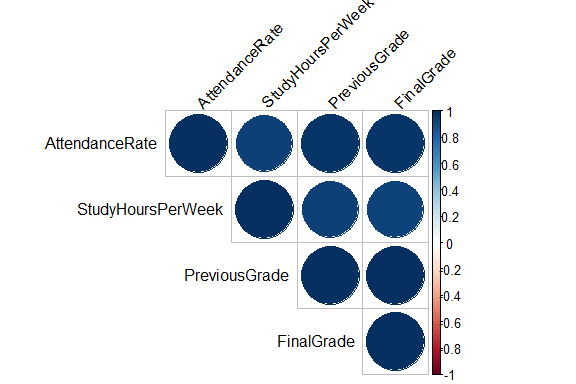

Student Performance Prediction
================
Trevor Okinda
2024

- [Student Details](#student-details)
- [Setup Chunk](#setup-chunk)
  - [Source:](#source)
  - [Reference:](#reference)
- [Understanding the Dataset (Exploratory Data Analysis
  (EDA))](#understanding-the-dataset-exploratory-data-analysis-eda)
  - [Loading the Dataset](#loading-the-dataset)
  - [Measures of Frequency](#measures-of-frequency)
  - [Measures of Central Tendency](#measures-of-central-tendency)
  - [Measures of Distribution](#measures-of-distribution)
  - [Measures of Relationship](#measures-of-relationship)
  - [ANOVA](#anova)
  - [Plots](#plots)
- [Preprocessing & Data
  Transformation](#preprocessing--data-transformation)
  - [Missing Values](#missing-values)
- [Training Model](#training-model)
  - [LOOCV](#loocv)
  - [Train different Models](#train-different-models)
  - [Performance Comparison](#performance-comparison)
  - [Saving Model](#saving-model)

# Student Details

|                       |                                |
|-----------------------|--------------------------------|
| **Student ID Number** | 134780                         |
| **Student Name**      | Trevor Okinda                  |
| **BBIT 4.2 Group**    | C                              |
| **Project Name**      | Student Performance Prediction |

# Setup Chunk

**Note:** the following KnitR options have been set as the global
defaults: <BR>
`knitr::opts_chunk$set(echo = TRUE, warning = FALSE, eval = TRUE, collapse = FALSE, tidy = TRUE)`.

More KnitR options are documented here
<https://bookdown.org/yihui/rmarkdown-cookbook/chunk-options.html> and
here <https://yihui.org/knitr/options/>.

### Source:

The dataset that was used can be downloaded here: *\<<a
href="https://www.kaggle.com/datasets/zaraavagyan/weathercsv/discussion\"
class="uri">https://www.kaggle.com/datasets/zaraavagyan/weathercsv/discussion\</a>\>*

### Reference:

*\<Avagyan, Z. (2017). Weather CSV \[Data set\]. Kaggle.
<a href="https://www.kaggle.com/datasets/zaraavagyan/weathercsv\"
class="uri">https://www.kaggle.com/datasets/zaraavagyan/weathercsv\</a>\>  
Refer to the APA 7th edition manual for rules on how to cite datasets:
<https://apastyle.apa.org/style-grammar-guidelines/references/examples/data-set-references>*

# Understanding the Dataset (Exploratory Data Analysis (EDA))

## Loading the Dataset

``` r
# Load dataset
StudentData <- read.csv("student_performance.csv", colClasses = c(
  Gender = "factor",
  AttendanceRate = "numeric",
  StudyHoursPerWeek = "numeric",
  PreviousGrade = "numeric",
  ExtracurricularActivities = "numeric",
  ParentalSupport = "factor",
  FinalGrade = "numeric"
))
# Preview structure and data
str(StudentData)
```

    ## 'data.frame':    10 obs. of  7 variables:
    ##  $ Gender                   : Factor w/ 2 levels "Female","Male": 2 1 2 2 1 1 2 1 2 1
    ##  $ AttendanceRate           : num  85 90 78 92 88 95 70 85 82 91
    ##  $ StudyHoursPerWeek        : num  15 20 10 25 18 30 8 17 12 22
    ##  $ PreviousGrade            : num  78 85 65 90 82 88 60 77 70 86
    ##  $ ExtracurricularActivities: num  1 2 0 3 2 1 0 1 2 3
    ##  $ ParentalSupport          : Factor w/ 3 levels "High","Low","Medium": 1 3 2 1 3 1 2 3 2 1
    ##  $ FinalGrade               : num  80 87 68 92 85 90 62 78 72 88

``` r
head(StudentData)
```

    ##   Gender AttendanceRate StudyHoursPerWeek PreviousGrade
    ## 1   Male             85                15            78
    ## 2 Female             90                20            85
    ## 3   Male             78                10            65
    ## 4   Male             92                25            90
    ## 5 Female             88                18            82
    ## 6 Female             95                30            88
    ##   ExtracurricularActivities ParentalSupport FinalGrade
    ## 1                         1            High         80
    ## 2                         2          Medium         87
    ## 3                         0             Low         68
    ## 4                         3            High         92
    ## 5                         2          Medium         85
    ## 6                         1            High         90

``` r
View(StudentData)
```

## Measures of Frequency

``` r
# Measures of Frequency
# Frequency of Gender
table(StudentData$Gender)
```

    ## 
    ## Female   Male 
    ##      5      5

``` r
# Frequency of Parental Support levels
table(StudentData$ParentalSupport)
```

    ## 
    ##   High    Low Medium 
    ##      4      3      3

## Measures of Central Tendency

``` r
# Measures of Central Tendency
# Central Tendency: Mean & Median
mean(StudentData$AttendanceRate)
```

    ## [1] 85.6

``` r
median(StudentData$AttendanceRate)
```

    ## [1] 86.5

``` r
mean(StudentData$StudyHoursPerWeek)
```

    ## [1] 17.7

``` r
median(StudentData$StudyHoursPerWeek)
```

    ## [1] 17.5

``` r
mean(StudentData$FinalGrade)
```

    ## [1] 80.2

``` r
median(StudentData$FinalGrade)
```

    ## [1] 82.5

``` r
# Mode function (for categorical/factor or numeric variables)
get_mode <- function(v) {
  uniqv <- unique(v)
  uniqv[which.max(tabulate(match(v, uniqv)))]
}

get_mode(StudentData$ParentalSupport)
```

    ## [1] High
    ## Levels: High Low Medium

``` r
get_mode(StudentData$Gender)
```

    ## [1] Male
    ## Levels: Female Male

## Measures of Distribution

``` r
# Measures of Distribution
# Standard Deviation
sd(StudentData$AttendanceRate)
```

    ## [1] 7.441625

``` r
sd(StudentData$StudyHoursPerWeek)
```

    ## [1] 6.848357

``` r
sd(StudentData$FinalGrade)
```

    ## [1] 10.0973

``` r
# Range
range(StudentData$AttendanceRate)
```

    ## [1] 70 95

``` r
range(StudentData$StudyHoursPerWeek)
```

    ## [1]  8 30

``` r
range(StudentData$FinalGrade)
```

    ## [1] 62 92

``` r
# IQR (Interquartile Range)
IQR(StudentData$AttendanceRate)
```

    ## [1] 8

``` r
IQR(StudentData$StudyHoursPerWeek)
```

    ## [1] 8.75

``` r
IQR(StudentData$FinalGrade)
```

    ## [1] 14.25

## Measures of Relationship

``` r
# Correlation matrix for numeric predictors and FinalGrade
numeric_vars <- StudentData[, sapply(StudentData, is.numeric)]
cor(numeric_vars)
```

    ##                           AttendanceRate StudyHoursPerWeek PreviousGrade
    ## AttendanceRate                 1.0000000         0.9348848     0.9739461
    ## StudyHoursPerWeek              0.9348848         1.0000000     0.9305352
    ## PreviousGrade                  0.9739461         0.9305352     1.0000000
    ## ExtracurricularActivities      0.6911723         0.5632860     0.7434319
    ## FinalGrade                     0.9741770         0.9264890     0.9984570
    ##                           ExtracurricularActivities FinalGrade
    ## AttendanceRate                            0.6911723  0.9741770
    ## StudyHoursPerWeek                         0.5632860  0.9264890
    ## PreviousGrade                             0.7434319  0.9984570
    ## ExtracurricularActivities                 1.0000000  0.7437064
    ## FinalGrade                                0.7437064  1.0000000

## ANOVA

``` r
# Visual correlation plot (optional)
# install.packages("corrplot") if needed
library(corrplot)
```

    ## corrplot 0.95 loaded

``` r
corrplot(cor(numeric_vars), method = "number")
```

<!-- -->

``` r
# ANOVA to check if FinalGrade differs by Gender
anova_gender <- aov(FinalGrade ~ Gender, data = StudentData)
summary(anova_gender)
```

    ##             Df Sum Sq Mean Sq F value Pr(>F)  
    ## Gender       1  291.6  291.60   3.727 0.0897 .
    ## Residuals    8  626.0   78.25                 
    ## ---
    ## Signif. codes:  0 '***' 0.001 '**' 0.01 '*' 0.05 '.' 0.1 ' ' 1

``` r
# ANOVA to check if FinalGrade differs by Parental Support
anova_parental_support <- aov(FinalGrade ~ ParentalSupport, data = StudentData)
summary(anova_parental_support)
```

    ##                 Df Sum Sq Mean Sq F value  Pr(>F)   
    ## ParentalSupport  2  739.3   369.6   14.51 0.00324 **
    ## Residuals        7  178.3    25.5                   
    ## ---
    ## Signif. codes:  0 '***' 0.001 '**' 0.01 '*' 0.05 '.' 0.1 ' ' 1

``` r
# Post-hoc Tukey's HSD for ParentalSupport
tukey_result <- TukeyHSD(anova_parental_support)
summary(tukey_result)
```

    ##                 Length Class  Mode   
    ## ParentalSupport 12     -none- numeric

``` r
# Post-hoc Tukey's HSD for Gender (optional, if needed)
tukey_gender <- TukeyHSD(anova_gender)
summary(tukey_gender)
```

    ##        Length Class  Mode   
    ## Gender 4      -none- numeric

## Plots

``` r
# Load ggplot2 for plotting
library(ggplot2)

# Histogram for FinalGrade (continuous variable)
ggplot(StudentData, aes(x = FinalGrade)) +
  geom_histogram(binwidth = 5, fill = "skyblue", color = "black") +
  labs(title = "Histogram of FinalGrade", x = "FinalGrade", y = "Frequency")
```

<!-- -->

``` r
# Boxplot for StudyHoursPerWeek (continuous variable)
ggplot(StudentData, aes(x = "", y = StudyHoursPerWeek)) +
  geom_boxplot(fill = "orange", color = "black") +
  labs(title = "Boxplot of StudyHoursPerWeek", y = "Study Hours Per Week")
```

<!-- -->

``` r
# Bar plot for Gender (categorical variable)
ggplot(StudentData, aes(x = Gender)) +
  geom_bar(fill = "lightgreen", color = "black") +
  labs(title = "Bar Plot of Gender", x = "Gender", y = "Count")
```

<!-- -->

``` r
# Bar plot for ParentalSupport (categorical variable)
ggplot(StudentData, aes(x = ParentalSupport)) +
  geom_bar(fill = "lightcoral", color = "black") +
  labs(title = "Bar Plot of Parental Support", x = "Parental Support", y = "Count")
```

<!-- -->

``` r
# Scatter plot for StudyHoursPerWeek vs FinalGrade (continuous vs continuous)
ggplot(StudentData, aes(x = StudyHoursPerWeek, y = FinalGrade)) +
  geom_point(color = "blue") +
  labs(title = "Scatter Plot of Study Hours vs Final Grade", x = "Study Hours Per Week", y = "Final Grade") +
  geom_smooth(method = "lm", color = "red")  # Adds a linear regression line
```

    ## `geom_smooth()` using formula = 'y ~ x'

<!-- -->

``` r
# Scatter plot faceted by Gender
ggplot(StudentData, aes(x = StudyHoursPerWeek, y = FinalGrade)) +
  geom_point(aes(color = Gender)) +
  labs(title = "Study Hours vs Final Grade by Gender", x = "Study Hours Per Week", y = "Final Grade") +
  facet_wrap(~ Gender)  # Facets the plot by Gender
```

<!-- -->

``` r
# Boxplot for FinalGrade by ParentalSupport
ggplot(StudentData, aes(x = ParentalSupport, y = FinalGrade, fill = ParentalSupport)) +
  geom_boxplot() +
  labs(title = "Boxplot of FinalGrade by Parental Support", x = "Parental Support", y = "Final Grade") +
  scale_fill_brewer(palette = "Set3")
```

<!-- -->

``` r
# Load the corrplot package
library(corrplot)

# Select continuous variables for correlation
cont_vars <- StudentData[, c("AttendanceRate", "StudyHoursPerWeek", "PreviousGrade", "FinalGrade")]

# Compute the correlation matrix
cor_matrix <- cor(cont_vars)

# Plot the correlation matrix
corrplot(cor_matrix, method = "circle", type = "upper", tl.col = "black", tl.srt = 45)
```

<!-- -->

# Preprocessing & Data Transformation

## Missing Values

``` r
# Check for missing values in the entire dataset
missing_values <- colSums(is.na(StudentData))

# Print the number of missing values in each column
print(missing_values)
```

    ##                    Gender            AttendanceRate         StudyHoursPerWeek 
    ##                         0                         0                         0 
    ##             PreviousGrade ExtracurricularActivities           ParentalSupport 
    ##                         0                         0                         0 
    ##                FinalGrade 
    ##                         0

``` r
# If you want to see if there are any columns with missing values
if (any(missing_values > 0)) {
  cat("There are missing values in the following columns:\n")
  print(names(missing_values[missing_values > 0]))
} else {
  cat("There are no missing values in the dataset.")
}
```

    ## There are no missing values in the dataset.

``` r
# Load VIM package
library(VIM)
```

    ## Loading required package: colorspace

    ## Loading required package: grid

    ## The legacy packages maptools, rgdal, and rgeos, underpinning the sp package,
    ## which was just loaded, will retire in October 2023.
    ## Please refer to R-spatial evolution reports for details, especially
    ## https://r-spatial.org/r/2023/05/15/evolution4.html.
    ## It may be desirable to make the sf package available;
    ## package maintainers should consider adding sf to Suggests:.
    ## The sp package is now running under evolution status 2
    ##      (status 2 uses the sf package in place of rgdal)

    ## VIM is ready to use.

    ## Suggestions and bug-reports can be submitted at: https://github.com/statistikat/VIM/issues

    ## 
    ## Attaching package: 'VIM'

    ## The following object is masked from 'package:datasets':
    ## 
    ##     sleep

``` r
# Visualize missing data
aggr_plot <- aggr(StudentData, col=c('skyblue', 'red'), numbers=TRUE, sortVars=TRUE, labels=names(StudentData), cex.axis=0.7, gap=3, ylab=c("Missing data", "Pattern"))
```

<!-- -->

    ## 
    ##  Variables sorted by number of missings: 
    ##                   Variable Count
    ##                     Gender     0
    ##             AttendanceRate     0
    ##          StudyHoursPerWeek     0
    ##              PreviousGrade     0
    ##  ExtracurricularActivities     0
    ##            ParentalSupport     0
    ##                 FinalGrade     0

# Training Model

## LOOCV

``` r
# Load necessary libraries
library(caret)
```

    ## Loading required package: lattice

``` r
# Set up LOOCV using caret's trainControl
ctrl <- trainControl(method = "LOOCV")
```

## Train different Models

``` r
# Train a Random Forest model using LOOCV
rf_model <- train(FinalGrade ~ ., 
                  data = StudentData, 
                  method = "rf", 
                  trControl = ctrl)

# Print model results
print(rf_model)
```

    ## Random Forest 
    ## 
    ## 10 samples
    ##  6 predictor
    ## 
    ## No pre-processing
    ## Resampling: Leave-One-Out Cross-Validation 
    ## Summary of sample sizes: 9, 9, 9, 9, 9, 9, ... 
    ## Resampling results across tuning parameters:
    ## 
    ##   mtry  RMSE      Rsquared   MAE     
    ##   2     4.844364  0.8275317  3.704638
    ##   4     4.775544  0.8308521  3.556417
    ##   7     4.703699  0.8408150  3.505330
    ## 
    ## RMSE was used to select the optimal model using the smallest value.
    ## The final value used for the model was mtry = 7.

``` r
# Train a K-Nearest Neighbors model using LOOCV
knn_model <- train(FinalGrade ~ ., 
                   data = StudentData, 
                   method = "knn", 
                   trControl = ctrl)

# Print results for KNN
print(knn_model)
```

    ## k-Nearest Neighbors 
    ## 
    ## 10 samples
    ##  6 predictor
    ## 
    ## No pre-processing
    ## Resampling: Leave-One-Out Cross-Validation 
    ## Summary of sample sizes: 9, 9, 9, 9, 9, 9, ... 
    ## Resampling results across tuning parameters:
    ## 
    ##   k  RMSE       Rsquared   MAE     
    ##   5   6.027603  0.8507987  4.540000
    ##   7   8.072124  0.7574952  6.514286
    ##   9  10.643493  1.0000000  9.111111
    ## 
    ## RMSE was used to select the optimal model using the smallest value.
    ## The final value used for the model was k = 5.

## Performance Comparison

``` r
# Load necessary library
library(ggplot2)

# Extract model performance
rf_results <- rf_model$results
knn_results <- knn_model$results

# Select the best tuning parameter results
rf_best <- rf_results[which.min(rf_results$RMSE), ]
knn_best <- knn_results[which.min(knn_results$RMSE), ]

# Create a dataframe for plotting
performance_df <- data.frame(
  Model = c("RandomForest", "KNN"),
  RMSE = c(rf_best$RMSE, knn_best$RMSE),
  Rsquared = c(rf_best$Rsquared, knn_best$Rsquared)
)

# Plot RMSE comparison
ggplot(performance_df, aes(x = Model, y = RMSE, fill = Model)) +
  geom_bar(stat = "identity", width = 0.6) +
  labs(title = "RMSE Comparison", y = "Root Mean Squared Error") +
  theme_minimal()
```

<!-- -->

``` r
# Plot R-squared comparison
ggplot(performance_df, aes(x = Model, y = Rsquared, fill = Model)) +
  geom_bar(stat = "identity", width = 0.6) +
  labs(title = "R-squared Comparison", y = "R²") +
  theme_minimal()
```

<!-- -->

## Saving Model

``` r
# Saving the Random Forest model
saveRDS(rf_model, "./models/saved_rf_model_student.rds")

# Load the saved model
loaded_rf_model_student <- readRDS("./models/saved_rf_model_student.rds")

# Model predicts FinalGrade
new_student <- data.frame(
  Gender = factor("Male", levels = levels(StudentData$Gender)),
  AttendanceRate = 85,
  StudyHoursPerWeek = 15,
  PreviousGrade = 78,
  ExtracurricularActivities = 2,
  ParentalSupport = factor("High", levels = levels(StudentData$ParentalSupport))
)

# Use the loaded model to make predictions
predicted_grade <- predict(loaded_rf_model_student, newdata = new_student)

# Print prediction
print(predicted_grade)
```

    ##       1 
    ## 79.4201
